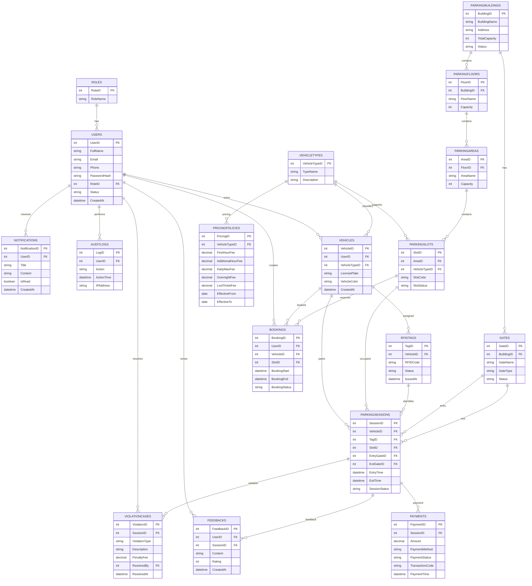

# Parking Building Management System - ERD

```mermaid
erDiagram

    ROLES {
        int RoleID PK
        string RoleName
    }

    USERS {
        int UserID PK
        string FullName
        string Email
        string Phone
        string PasswordHash
        int RoleID FK
        string Status
        datetime CreatedAt
    }

    NOTIFICATIONS {
        int NotificationID PK
        int UserID FK
        string Title
        string Content
        boolean IsRead
        datetime CreatedAt
    }

    AUDITLOGS {
        int LogID PK
        int UserID FK
        string Action
        datetime ActionTime
        string IPAddress
    }

    VEHICLETYPES {
        int VehicleTypeID PK
        string TypeName
        string Description
    }

    VEHICLES {
        int VehicleID PK
        int UserID FK
        int VehicleTypeID FK
        string LicensePlate
        string VehicleColor
        datetime CreatedAt
    }

    RFIDTAGS {
        int TagID PK
        int VehicleID FK
        string RFIDCode
        string Status
        datetime IssuedAt
    }

    PARKINGBUILDINGS {
        int BuildingID PK
        string BuildingName
        string Address
        int TotalCapacity
        string Status
    }

    PARKINGFLOORS {
        int FloorID PK
        int BuildingID FK
        string FloorName
        int Capacity
    }

    PARKINGAREAS {
        int AreaID PK
        int FloorID FK
        string AreaName
        int Capacity
    }

    PARKINGSLOTS {
        int SlotID PK
        int AreaID FK
        int VehicleTypeID FK
        string SlotCode
        string SlotStatus
    }

    GATES {
        int GateID PK
        int BuildingID FK
        string GateName
        string GateType
        string Status
    }

    BOOKINGS {
        int BookingID PK
        int UserID FK
        int VehicleID FK
        int SlotID FK
        datetime BookingStart
        datetime BookingEnd
        string BookingStatus
    }

    PARKINGSESSIONS {
        int SessionID PK
        int VehicleID FK
        int TagID FK
        int SlotID FK
        int EntryGateID FK
        int ExitGateID FK
        datetime EntryTime
        datetime ExitTime
        string SessionStatus
    }

    PRICINGPOLICIES {
        int PricingID PK
        int VehicleTypeID FK
        decimal FirstHourFee
        decimal AdditionalHourFee
        decimal DailyMaxFee
        decimal OvernightFee
        decimal LostTicketFee
        date EffectiveFrom
        date EffectiveTo
    }

    PAYMENTS {
        int PaymentID PK
        int SessionID FK
        decimal Amount
        string PaymentMethod
        string PaymentStatus
        string TransactionCode
        datetime PaymentTime
    }

    FEEDBACKS {
        int FeedbackID PK
        int UserID FK
        int SessionID FK
        string Content
        int Rating
        datetime CreatedAt
    }

    VIOLATIONCASES {
        int ViolationID PK
        int SessionID FK
        string ViolationType
        string Description
        decimal PenaltyFee
        int ResolvedBy FK
        datetime ResolvedAt
    }

    ROLES ||--o{ USERS : has

    USERS ||--o{ NOTIFICATIONS : receives
    USERS ||--o{ AUDITLOGS : performs
    USERS ||--o{ VEHICLES : owns
    USERS ||--o{ BOOKINGS : creates
    USERS ||--o{ FEEDBACKS : writes
    USERS ||--o{ VIOLATIONCASES : resolves

    VEHICLETYPES ||--o{ VEHICLES : classifies
    VEHICLETYPES ||--o{ PARKINGSLOTS : supports
    VEHICLETYPES ||--o{ PRICINGPOLICIES : pricing

    VEHICLES ||--o{ RFIDTAGS : assigned
    VEHICLES ||--o{ BOOKINGS : booked
    VEHICLES ||--o{ PARKINGSESSIONS : parks

    PARKINGBUILDINGS ||--o{ PARKINGFLOORS : contains
    PARKINGBUILDINGS ||--o{ GATES : has

    PARKINGFLOORS ||--o{ PARKINGAREAS : contains

    PARKINGAREAS ||--o{ PARKINGSLOTS : contains

    PARKINGSLOTS ||--o{ BOOKINGS : reserved
    PARKINGSLOTS ||--o{ PARKINGSESSIONS : occupied

    RFIDTAGS ||--o{ PARKINGSESSIONS : identifies

    GATES ||--o{ PARKINGSESSIONS : entry
    GATES ||--o{ PARKINGSESSIONS : exit

    PARKINGSESSIONS ||--o{ PAYMENTS : payment
    PARKINGSESSIONS ||--o{ FEEDBACKS : feedback
    PARKINGSESSIONS ||--o{ VIOLATIONCASES : violation
```